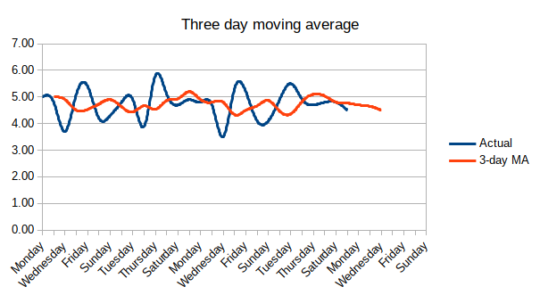
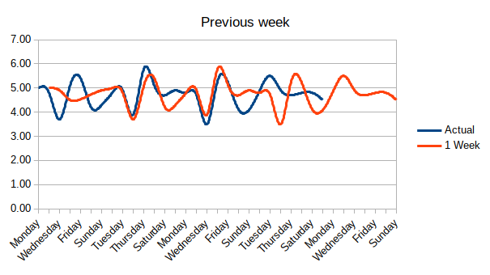
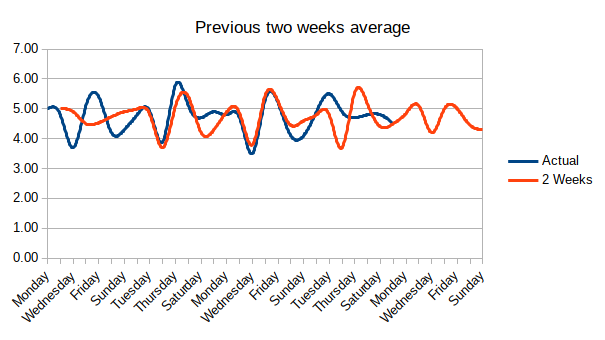
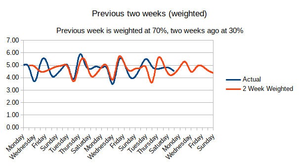
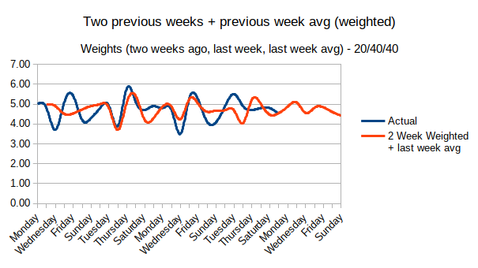

# Utility & Resource Calculations

## Water
* Water will be calculated using _cu.ft./day_ (cubic feet per day)
* To calculate the projected water usage for a billing period:
  * (Total Usage in period / Number of days sampled) * Number of days remaining in period

## Power
* Power will be calculated using _kWh/day_ (kilowatt hours per day)
* To calculate the projected power usage for a billing period:
  * (Total Usage in period / Number of days sampled) * Number of days remaining in period

## Rent
* Rent is fixed rate per period.
* To calculate the remaining rent when starting on a day besides the first of the period:
  * (Amount per month / Number of days in period) * Days remaining in period

## Trash
* Trash is fixed rate per period.
* To calculate the remaining trash when starting on a day besides the first of the period:
  * (Amount per month / Number of days in period) * Days remaining in period

# Charts
Charts should be displayed for water and power usage only.
Since rent and trash are fixed rate, there is no need to display charts for these utilities.

## Chart equations
All chart equations are available in [this spreadsheet](https://github.com/042020-dotnet-uta/jaysonlennon-repo2/blob/master/Project2/doc/utility-projection-calculator.ods).

The charts will display the actual usage of the utility, and a projected usage based on history.

Here are some potential charts using different criteria for calculations.
Each gets progressively more complicated to implement, but should be doable.

The 3 day moving average is mostly inaccurate and only capable of predicting a few days ahead.

Sampling just the previous week is accurate as long as usage is similar each week, but it is highly susceptible to changes in usage.

The two week average is fairly similar to the "previous week sampling."

This chart gives weights to each week and helps stabilize the prediction when changes in usage occurs.

Lastly, this considers not only the last two weeks, but also averages the entire previous week to help adjust for changes in usage.

